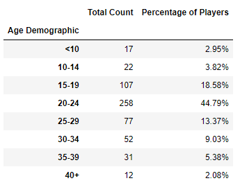
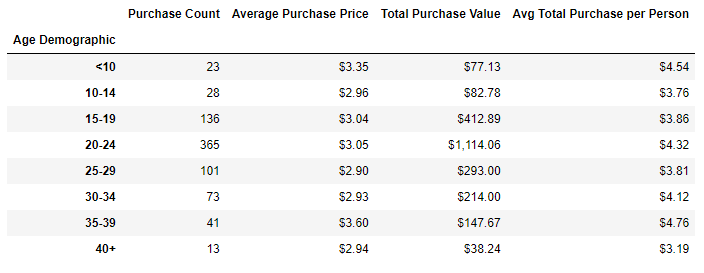
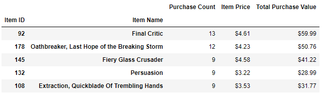
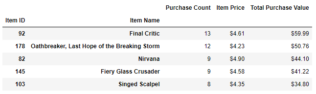

# pandas-challenge

## Project Outline

This project required that I analyse the data from an independent games company and their latest game, Heroes of PyMoli.

All data was stored in a CSV file, requiring it to be read into a useable form via Pandas inside Jupyter Notebooks.

Once the data had been read by the code, I was required to manipulate the data to output a number of tables used to draw insights about the players and purchases made in-game.

The full data/report can be viewed in the HeroesofPyMoli directory, by loading the HeroesofPyMoli_CDW.ipynb and viewing the tables contained in that file.

## Data Gathered for the Report

When analysing the data for Heroes of PyMoli, I was tasked with returning the below information:

* Player Count
* Purchasing Analysis (Totals)
* Gender Demographics
* Purchasing Analysis (Gender)
* Age Demographics
* Purchasing Analysis (Age)
* Top Spenders
* Most Popular Items
* Most Profitable Items

All outputs above are generated as a dataframe inside the HeroesofPyMoli_CDW.ipynb workbook.

## Insights from the Data

### Gender Insights

From the data provided we can draw some conclusions around the Heroes of PyMoli Player base.

The first piece of information which stands out is that the player base is overwhelmingly male, with 84.03% of players identifying as male.

This is in comparison to the 14.06% who identified as Female and 1.91% listed as Other/Non-Discolsed.

Of interest in this gender analysis, is that while males make up the majority of the player base, the female and non-disclosed gender players do have a higher average spend, both in total and per person.

Female and non-disclosed players show an average total spend per person oup to 49 cents higher than male players, though their average total purchase is only higher by a maximum of 35 cents.

These differences are also cancelled out with sheer volume when looking at purchases by Male customers, with 652 purchases total being almost six times as many as the Female players and 13 times as many as the non-disclosed players.

Male players make up both the majority of the player base and the majority of the purchases made in Heroes of PyMoli.

### Age Insights

When looking at the players grouped by age, we see a fairly unsurprising trend, with a majority of players aged between 15 and 29, prime years for those who are most interested in video games.

These players also rtepresent the most value in purchasesd with the 20-24 year age group being the most profitable. These players have the third highest average purchase price, and the third highest average total purchase per person but their volume of purchases is almost three times higher than the next age group (15-19).

These players represent almost 50% of the total purchases made in the game.

### Item Insights

The most popular item to purchase in the Heroes of PyMoli game is Final Critic.

This item has been purchased 13 times, and is also the item with the largest value for total sales.

There is only one item in the top 5 most profitable items which has not reached 9 unit sales, that is the 'Singed Scalpel' which has 8 purchases but with a higher unit cost has become the fifth most profitable item in the game.

